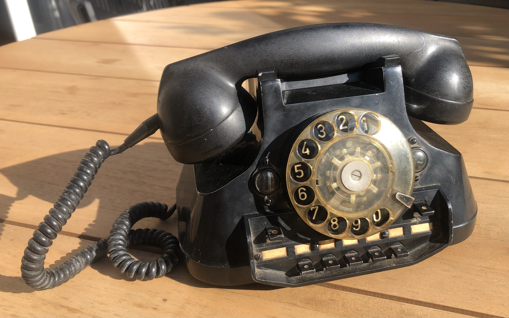
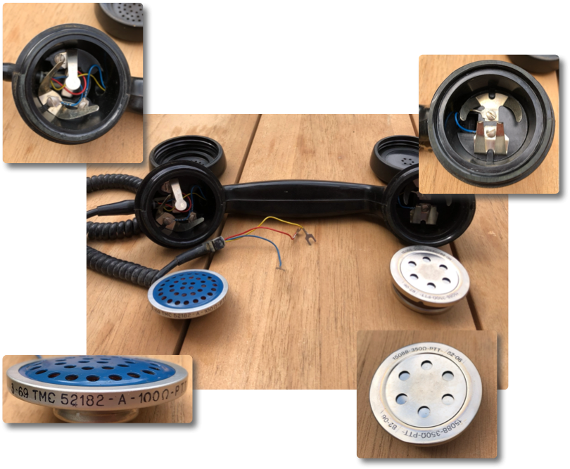
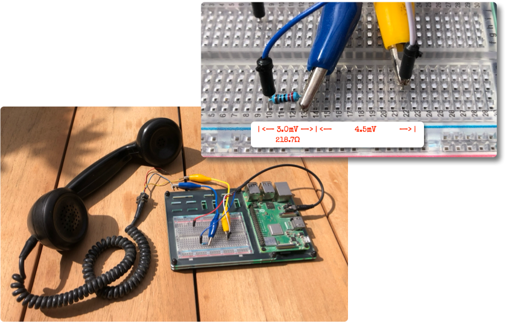
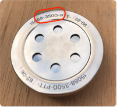

# The Phone
A game on a rotary phone.

<p align="center" width="100%">
    
</p>

## Project Objective
The current project objective is to play a very simple game on an old rotary
phone that I got. The player picks up the handset and is drawn into a murder
mystery. The player hears the story on the headset and can decide actions using
the rotary dial.

## Playing Audio
The first order of business is to be able to play audio. The Raspberry Pi has a
simple, 3.5mm headphone output. As chance would have it, the Raspberry Pi
headphone jack is actually quite well suited for the old, high impedance
speakers of rotary phones.

The rotary phones were designed to be highly efficient at low voltages and low
currents. They are relatively high impedance (mine measures about _328Ω_, more
on that in the appropriate rabbit hole, below). Modern speakers are designed for
much lower impedances and for higher voltages and currents. A modern amplifier
can easily overdrive old, high efficiency speakers with too much current. The
high voltages and currents can overheat and damage the fragile coil.

For this project, we use a Raspberry Pi specifically. The headphone jack on a
Raspberry Pi is actually quite bad, by modern standards. at approximately _100Ω_
it is quite high impedance and its voltage range is quite limited. Lucky for us,
it is unlikely to overpower a vintage speaker driver. In fact, we may have
problems getting the volume up high enough to hear well.

The Raspberry Pi has other problems with audio, though. It is not very fast and
has trouble with the real-time requirements of audio playback. Bad quality once
more saves us here. The vintage telephone speakers could only play sound up to
about _3400Hz_, which is why telephone equipment typically uses a sample rate of
_8000Hz_. That is far lower than the sample rate needed to play music. By
playing the audio samples at an 8000Hz sample rate, we give the processor more
time to load the audio into the playback buffers. This resolved buffer underrun
issues.

## Programming Language
This project is best done in Python. It needs good access to the GPIO pins of
the Raspberry Pi, but also needs fairly advanced audio processing and (in the
future, maybe) speech recognition. Python can do all of those easily.

Python has an excellend library called
[sounddevice](https://pypi.org/project/sounddevice/) that handles selecting the
desired output device and can play WAV files easily.

# Appendix A: Original Phone Hardware
This appendix documents the phone's original hardware. It is well built and
feels nice to handle. It is surprisingly heavy, with a body cast from so-called
pot metal, a Zinc alloy.

<p align="center" width="100%">
    
</p>

PTT most likely refers to the only Dutch telecom operator at the time, called
_Staatsbedrijf der Posterijen, Telegrafie en Telefonie_.

This particular device seems to be assembled from parts of different phones. The
rotary dial is clear plastic and the original dial would probably have been
bakelite. There are also differences in wiring between the handset, the rotary
dial and the internals of the phone, which suggests that the handset and rotary
dial are not original for this body. That's not to say they do not go well
together, just observing that it is not a very valuable device, with its
non-original parts.

## Wiring and Clamps
The device is clearly built for servicability. Components are screwed in place,
and there as a number of clamps that allow easy configuration changes. The looms
have been hand-tied to be neat and tidy.

## The Handset
The handset feels really nice when handled. Someone spilled a lick of silver
paint on it and there are obvious signs of the material ageing, but the handset
is in otherwise excellent condition. Internally, only the microphone needed some
cleaning from what looked like nicotine stains.

<p align="center" width="100%">
    
</p>

The handset is wired as follows: blue for the common ground, red for the speaker
and yellow for the earpiece speaker. The speaker is marked _15088-350Ω-PTT
82-06_. The microphone is marked _3 - 69 TMC 52182 - A - 100Ω - P.T.T._

## Rotary Dial
The rotary dial seems to be more modern than the rest of the phone. Its cover is
made of clear plastic.

# Appendix B: Rabbit Holes
A project like this has a tendency to devolve into an endless string of rabbit
holes. A large part of achieving the project goal is to pick which rabbit hole
to fall into and how deep. That said, rabbit holes are also learning experiences
and this project is really all about learning.

This appendix documents some of the rabbit holes, so that you may share in my
learning (and so I can find back my noites when I run into the same problem
again in the future).

## WiFi Stability on Rasberry Pi Rabbit Hole
Speaking of finding my notes again: the default power saving mode on the
wireless interface of the Raspberry Pi makes for some terrible wireless
connections, especially if (like me) you SSH into the device. Here is how to
disable the power saving mode in a way that survives reboots. This code is from
[wlan0 power management - how to permanently set to off](https://forums.raspberrypi.com/viewtopic.php?t=337943)

You can check the current status of the power save mode with the following
command, which will show either `on` or `off`. Default is `on`.

```shell
iw dev wlan0 get power_save
```

Then copy the code from `rabbit-holes/wifi-power-save/wlan0pwr.service` into
`/etc/systemd/system/wlan0pwr.service`.

```shell
sudo cp rabbit-holes/wifi-power-save/wlan0pwr.service /etc/systemd/system
sudo systemctl enable wlan0pwr
```

Reboot and check that the power save is now `off`. If it is still on, you likely
forgot to enable the service (like I did the first time).

## Measuring Speaker AC Impedance Rabbit Hole
Old speakers, such as the one in my rotary phone, were built to different
standards than modern audio equipment. The Raspberry Pi headphone jack is
designed to drive modern, low impedance headphones, while the rotary phone uses
a high impedance speaker. To get decent quality output (and to avoid breaking
components) we have to make sure that we do not drive the speaker with too much
current, as that can lead to overheating and damage to the coil.

The current in the speaker will be voltage divided by the impedance, so if we
know the voltage and the impedance, we can calculate the maximum current.
Speakers of this type should be happy up to about 5mW sustained, though I have
no good sources for that number. It does sound reasonable, so let's just take
that as our target maximum power. All we need now is a way to measure it.

Note: _Of course, we could just measure the DC resistance of the speaker and guess from
there, but that would not make for a very insightful rabbit hole. Alternatively,
we can open up the handset and see if the speaker has any markings. We will do
that only to validate the results, after we got them._

I wrote a small program in Python that generates a tone on the headphone jack of
the Raspberry Pi. You can control the volume by typing numbers into the terminal
where the code is running.

```shell
sudo apt-get install libportaudio2
cd rabbit-holes/speaker-impedance
python3 -m venv venv
source venv/bin/activate
pip install -r requirements.txt
```

Next build the circuit to measure the AC current. Here is a photo of my circuit.
The crocodile clamps go to the speaker wires and the Dupont leads have been
soldered to the 3.5mm headphone jack. The resistor is a simple resistor that
measured to be about _218.7Ω_.

<p align="center" width="100%">
    
</p>

Measuring the voltages gives us 3mV for the series resistor and 4.5mV across the
speaker. Using these values to calculate the current gives us _Vr / R = 3mv /
218.7Ω ≈ 13.7μA_. Calculating the power through the headset gives us _Vspk × I =
4.5mV × 13.7μA ≈ 0.062μW_.

That should be low enough to avoid speaker damage. It should be safe to drive
the speaker from the Raspberry Pi headphone jack with no risk of damage.

While we have these values, let's calculate the measured AC impedance of the
speaker. To calcualte the impedance _Zspk_, we have _Zspk = Vspk / I = 4.5mV /
13.7μA ≈ 328Ω_. After opening up the handset, the markings say that the rated
speaker impedance is _350Ω_, so we were about _6.5%_ off. Close enough given the
simplicity of my setup.

<p align="center" width="100%">
    
</p>


